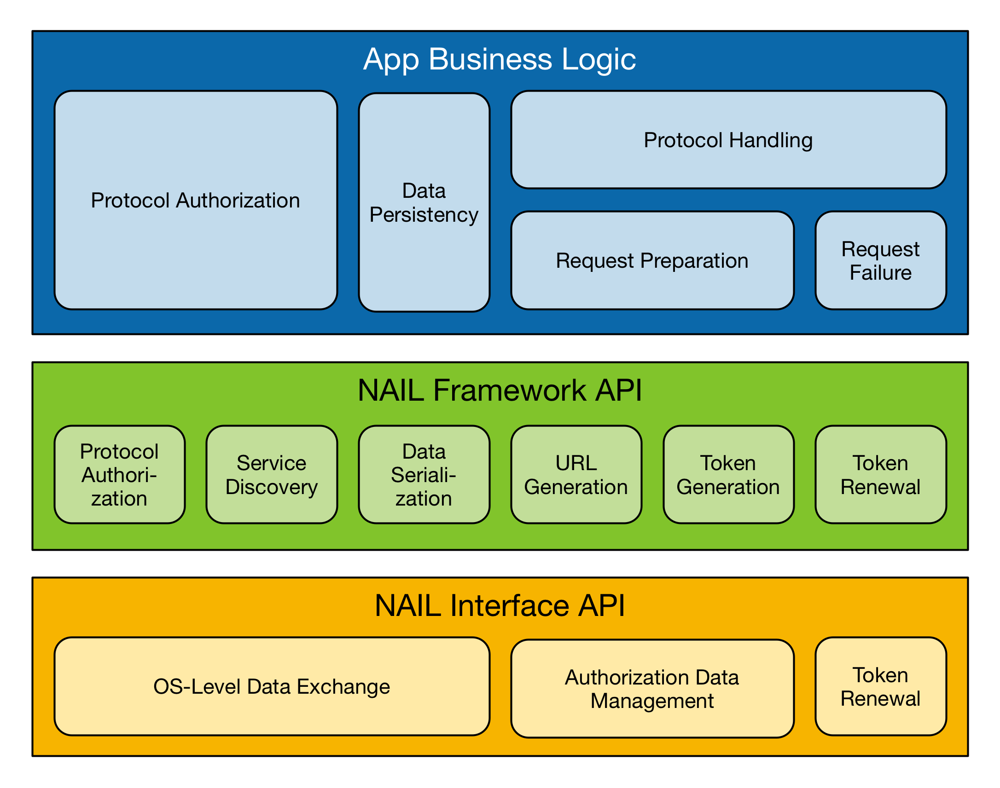

# Native Application Integration Layer

## Introduction

The Native Application Integration Layer (NAIL) API abstracts the __access management__ for authorized data-exchange with Federation Services. This includes abstraction of OAuth2-specific, authentication protocol specific and OS-specific interactions for third party applications that run natively on the users' devices.

Apps are expected to rely on public protocols to access services.

The NAIL API is designed to facilitate simultaneous connections to several service endpoints. Apps that can handle only one simultaneous authorization MAY limit this support. Otherwise it is always safe to assume that average users in the Swiss academic domain have access to more than one Federation Service that meets an app's protocol requirements.

While NAIL supports the protocol of the Swiss edu-ID Mobile App, it is agnostic to the authorizing app. The only requirement is that the authorizing app uses the same data formats.

## NAIL API Overview

The NAIL API supports two interactions with the edu-ID trust domains. From the business logic perspective of a third party app these two interactions relate to:

1. Protocol authorization (7), and
2. Protocol handling (9)

The NAIL API __does not__ facilitate or validate protocol requests. It relies on the third party app's capabilities to handle protocol specifications appropriately.

The NAIL API separated into two components.

* The NAIL Interface API is defines OS-specific interactions and data structures that are required to exchange data with the edu-ID Mobile App or Federation Services. The Interface API handles three tasks:

    1. The OS-level data exchange with the edu-ID Mobile App (7).
    2. Management of authorization data including protocol endpoints (9).
    3. Token renewal (9)

* The NAIL Framework API is the primary interface for third party app developers and abstracts the NAIL Interface API so developers can focus on their business logic. The NAIL Framework API abstract the NAIL Interface API into common function calls that are shared across platforms. At this level the NAIL Framework API supports six tasks:

     1. Protocol authorization and endpoint discovery (7)
     2. Service discovery (7*)
     3. Endpoint URL generation during request preparation (9)
     4. Authorization token generation during request preparation (9)
     5. Token renewal (9)
     6. Data serialization for data persistency



Developers of third party apps will typically only use the NAIL Framework API.

## NAIL Framework API

The NAIL Framework API abstracts all protocol independent interface functions that are required for authorized protocol requests. It does not provide any logic for performing protocol requests. This allows developers to choose appropriate channels for authorized interactions.

The NAIL Framework API provides a singleton class interface.

The protocol authorization and endpoint discovery is supported by the API call.

```authorizeProtocols(protocolList) -> completionPromise```

```authorizeProtocols(protocolList, singleton) -> completionPromise```

This method implements the protocol authorization. It abstracts the OS-level data exchange with an authorizing mobile app, such as the edu-ID Mobile App. The completion of the request is asynchroneous. Therefore, this method requires a completion handler to return the result to the app's business logic.

The method expects a list of protocol names as the first parameter.

The two parameter variant expects a boolean value to indicate if the business logic can handle only one service authorization. In this case the authorizing app will be requested to ask the users for only one authorization. A business logic MUST NOT rely on that the authorizing app returns exactly one authorization.

The completion handler has no parameter.

```serviceNames() -> listOfServiceNames```

This method implements the service discovery. It returns the list of authorized service names obtained by all requests to ```authorizeProtocols()```.

If the NAIL did not receive any service authorizations, it will return an empty list.

```serialize() -> String```

This method serializes the internal data structures. The NAIL API does not ensure persistency. Therefore, the business logic MUST ensure that any persistent data is stored approrpiately. The ```serialize()``` method returns a UTF8 character string that can get used for initialising the NAIL API.

``` parse(nailSerialization) ```

This method parses the serialised data. This function is typically used during initialization.

```getDisplayName(serviceName) -> string```

This method returns the display name of an authorized Federation Service.

```getServiceUrl(serviceName) -> string```

This method returns the url of an authorized Federation Service.

```getEndpointUrl(serviceName, protocolName) -> uristring```

```getEndpointUrl(serviceName, protocolName, endpointPath) -> uristring```

This method returns the absolute URL for a token endpoint following the RSD2 URL building rules.

An app is ensured that all requested protocols are authorized by the service endpoints.

If a protocol has multiple endpoints, the relative service endpoint path for the request SHOULD be added here.

```getServiceToken(serviceName, protocolName) -> string```

```getServiceToken(serviceName, protocolName, endpointPath) -> string```

```getServiceToken(serviceName, protocolName, claims) -> string```

```getServiceToken(serviceName, protocolName, endpointPath, claims) -> string```

This method builds an authorization token for the requested service endpoint. This function initializes the a basic or a JWT Bearer token depending on the authorization provided for the service.

If a protocol has multiple endpoints, the relative service endpoint path for this token MUST be included.

If present, the claims parameter holds a dictionary object with additional claims to be added to a JWT token. Additional claims can be used to increase the security of the token. Protocols MAY require clients to set specific claims. If the service provided a basic bearer token, this parameter will be ignored.

JWT tokens MUST be regenerated for every request. Basic bearer tokens are persistent across requests, but it is RECOMMENDED to always request a new token from the NAIL API, because services MAY implement different authorization schemes. A business logic MUST NOT rely on a relation between the requested protocols and an authorziation scheme.

If the requested service return an empty string, the token has been expired. In this case the app's business logic SHOULD start a new authorization request.

``` revokeToken(serviceName) -> completionPromise```

This method revokes the app access token for a given service. After calling this method the service token cannot be used with the service. This is equivalent to an app-level logout.

This method authomatically removes the service from the NAIL API.

The completion handler receives a boolean value that indicates if the NAIL API was able to revoke the token.

``` removeService(serviceName) ```

This method removes an authorized service from the NAIL API. After a service has been removed from the NAIL API and the app's business logic requires data persistency, the business logic SHOULD serialize and store the data of the NAIL API using the ```serialize()``` method.

``` clearAllServices() ```

This method resets the NAIL API by removing all authorized services.

## NAIL Interface API

### Protocol Authorization

The NAIL protocol requires an app to present a set of information, including but not limited to its bundle id and name.

The core concept of the edu-ID Mobile App is that mobile apps can request authorization through standard mechnisms of the mobile OS.

On Android apps use the concept of [__intents__](https://developer.android.com/training/basics/intents/sending.html).

On iOS apps use the concept of [__app extensions__](https://developer.apple.com/library/ios/documentation/General/Conceptual/ExtensibilityPG/index.html).

Intents and app extensions share the common principle of named communication. This means that  the authorizing app expects incoming requests on a named data types.

Both, intents and app extensions allow only one request and response. Therefore, complex data exchange or data flows are not possible and all relevant information for the protocol request MUST be included into the payload data for the data exchange at the OS-level.

#### Data type name

The edu-ID Mobile App expects incoming requests for the follwing data type.

``` urn:ietf:params:oauth:assertion ```

Other data types MAY be supported, but are beyond the scope of this architecture.

#### Request data structure

The edu-ID Mobile App supports a identified protocol requests. This means an app instance needs to identify itself.

The request data structure MUST include the following data fields.

| Name | Type | Required |  Description |
| :--- | :--- | :--- | :--- |
| client_id | ```String``` | Yes | Unique identitifier of an app instance. This identifier SHOULD be obtained from the appropriate OS API. |
| app_id | ```String``` | Yes | The app's bundle-ID as registered in the repsective Application Store. |
| app_name | ```String``` | Yes | The apps display name as registered in the respective Application store. |
| protocols | ```Array``` | Yes | A list of protocol names. |
| token | ```JWT-String``` | No | signed JWT |
| single | ```Boolean``` | No | Indicates the preference of only one authorization. |

Apps MAY add a __signed__ JWT with the following claims.

* aud: containing the string ```urn:ietf:params:oauth:assertion```.
* sub: Unique identitifier of an app instance. MUST be identical to ```client_id```.
* iss: The app's bundle-ID. MUST be identical to ```app_id```.
* name: the apps display name. MUST be identical to ```app_name```.

The JWT MUST be signed with an app's private key.

If the ```token```-attribute is present in a protocol request, then an authorizing app MUST NOT respond to requests if they cannot validate the token.

Apps MAY use the single flag to indicate to an authorizing app a preference to receive only on authorization. Authorizing apps SHOULD limit the user choice to exactly one authorziation for the request.

#### Response data structure

Authorizing Apps MUST respond a list (array) containing filtered RSD2 objects. Filtered RSD2 objects contain reduced API information.

If no authorization has been granted, authorizing apps MUST return an empty list.

The response data MUST include only protocol endpoints for the requested protocols and for the oauth2 protocol.

Each RSD2 object MUST contain ```authorization``` information.

An app MUST be able to handle all authorizations included in the response.

An app MUST handle each authorization of the RSD2 objects independently.

Apps SHOULD assume that access is scoped to those protocols included in the RSD2 objects.

### Protocol handling

It is the app developer's responsibility to identify all relevant service endpoints of the requested protocols.

Apps that operate directly on the response data structure MUST  implement the endpoint URL generation algorithm as specified for the RSD2. Apps that use the NAIL Framework API can request endpoint URLs via the related API Methods.

If the service RSD authorization section provides an plain access token, then all endpoint requests MUST use this authorization token for all requests to service endpoints hosted on that service.

If the service RSD authorization section provides a JWT access token, then the app MUST generate request level authorization tokens for each request to a service endpoint.

Apps MUST NOT assume plain or JWT tokens for authorization.

Apps that use the NAIL Framework API will receive the appropriate authorization token via the token generation method.

### Access Restrictions

Apps SHOULD assume that all protocol authorizations are scoped to the requested protocols. Federation Services MAY revoke authorizations if a token is used outside of its scope.

If protocol requests return authorization errors, then an app MUST assume that the granted access token has expired. An app MUST NOT assume that the access tokens for other protocols have expired.

If a refresh token is present, then the app SHOULD try to obtain a new access token via the service's OAuth2 protocol's token endpoint. If the refresh token is also rejected an app MUST NOT try to connect to the service's protocol endpoints using the provided authorizations.

Apps SHOULD present appropriate user interfaces to inform users that an authorization has expired and has to be renewed via the authorization.

Apps MUST pay attention that services MAY provide per endpoint authorizations. These authorizations are independent from each other. If protocol endpoint specific authorization tokens are present the app MUST use the protocol authorization even if a service-wide authorization is present at the same time.

Apps MAY revoke an access token by using the [revoke endpoint](https://tools.ietf.org/html/rfc7009) of the OAuth protocol.

| [Previous: iOS App Architecture](32-ios-apparchitecture.md) | [Return to Architecture Overview](00-overview.md) | [Next: Operation Model](50-operational-model.md)|
| :---- | :----: | ----: |
