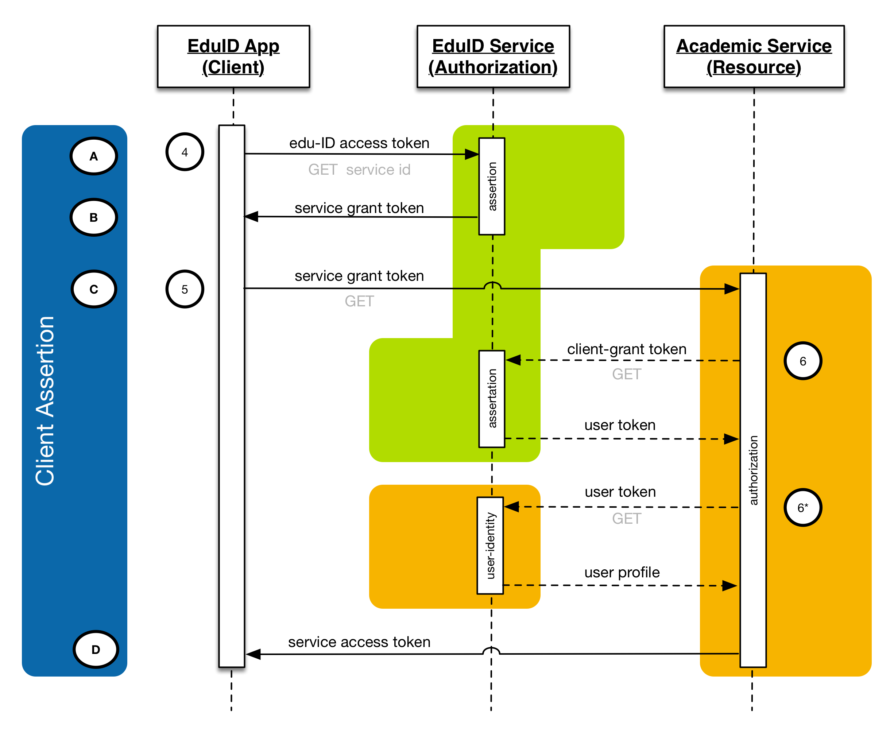
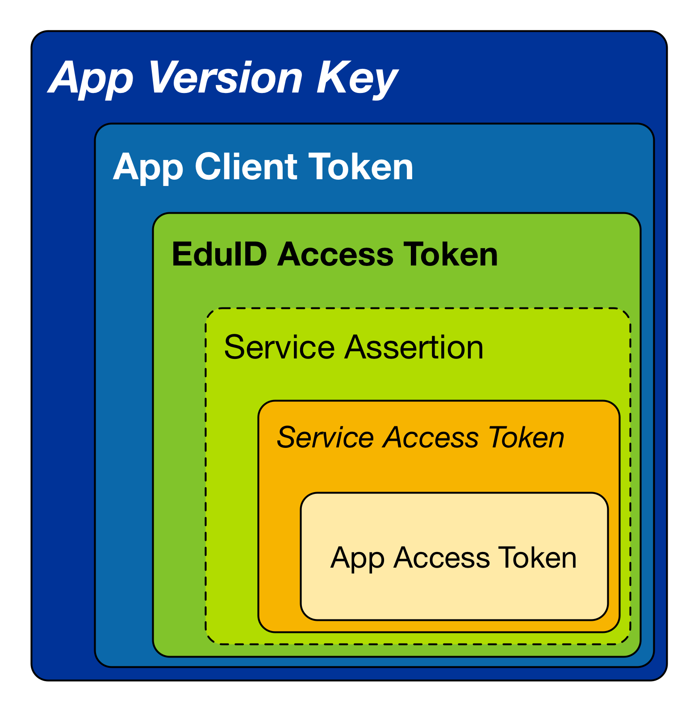

# Service Architecture

The edu-ID Mobile App provides an authorization and authentication interface for securely connecting third party apps with services in the trust domain of Swiss academic services. The edu-ID Mobile App ensures that commercial and non-commercial third party apps can provide added value services based on the existing service infrastructure in Swiss higher education institutions. The edu-ID App's key function is to authorise third party apps on a user's device with academic services within the edu-ID federation. It helps to bridge the user/app store trust domain on the user devices and the trust domain within the Swiss Academic Service Federation.

The edu-ID Mobile App integrates interactions between the edu-ID infrastructure, services in the academic edu-ID federation, and third-party apps installed on the users' devices. It limits service and data exposure to third-parties to authorised sources.

This document describes the overarching system architecture and service interaction protocols.

## Introduction

Authorization is a key element for offering personalised experiences. In higher education, authorization is a key for accreditation processes. With the increase of digital information processes in and around education of universities and universities of applied sciences there is also an increased need to connect mobile application and application-based service into administrative and educational processes.

The eduID Mobile App provides authorization services to third party apps on the mobile devices of federation users.

The edu-ID mobile app is not a stand alone mobile application but mediates processes and data of services within the academic domain and third-party apps. Therefore, the edu-ID Mobile App is part of an IT ecosystem that spawn across two trust domains:

Firstly, the edu-ID links to the Swiss academic trust domain, which is managed via a central edu-ID service as federation manager that connects distributed services at academic institutions participating in the federation. These distributed services include for example data storage, web-conferencing, online collaboration, or learning management systems. In the context of this document this trust domain is called the Academic Trust Domain.

Secondly, it is part of the user-and-app-store trust domain on the users' devices. This trust domain is courated by the end-users by installing apps on their devices and controlled by the app store host. The app store hosts manage access to application developers by setting and enforcing quality and security guidelines. Within the context of this document this trust domain is called User Device.

Within these trust domains there is exaclty one edu-ID service in the Academic Trust Domain and exactly one edu-ID mobile app on the User Device. The edu-ID service and the edu-ID Mobile App are tightly connected. This connection is controlled by the host of the edu-ID service, which creates a separate edu-ID trust domain that bridges the Academic Trust Domain to the User Device.

The Academic Trust Domain connects many distributed "academic services". These services are typically hosted by the institutions that are participating in the federation.

On the User Devices there can be many apps that are related to the users' productivity. These apps are installed and arranged by the owners of the User Devices.


Some of the services in the Academic Trust Doamin services expose service APIs for loosely-coupled machine-to-machine communication. Whereas tightly-coupled machine-to-machine communication requires explicit connections of two services typically initiated system wide by the system administrators, losely-coupled machine-to-machine communication allows unmanaged ad-hoc communications between services, tools and components. Tightly-coupled machine-to-machine communication can only be performed if all commuicators are known at the time of service coupling and controlable. Such connections create a pre-defined trust domain. In highly dynamic environments that spawn trust domains and involve many stakeholders, tight-coupling is resource intensive and does not easily scale. Loosely-coupled machine-to-machine communication overcomes the overhead of tight coupling by distributing coupling responsibility across the different stakeholders in the ecosystem.

Conventional [SAML]() Authentication and Authorization provides reliable identification and single-signon solutions within web-based trust domains. SAML-based approaches have been used to connect native mobile apps and distributed services. These approaches vary on the different platforms and require that native mobile apps are part of the same trust domain as the accessed services. SAML-based approaches are known to be prone to identity theft and viotation of intellectual property rights (IPR) if trust domains are naively assumed for native applications [REFERENCE MISSING](). This limits the applicability of SAML for loosely-coupled machine-to-machine communications, for which ad-hoc trust domains are established.

The edu-ID Mobile App ecosystem primarily focuses on client authorization and does not include an identity layer. Such layer might be provided by dedicated identity services based on LDIF, OpenID or Web-finger. Security aspects related to the identity profile layer are not addressed by the edu-ID Mobile App architecture.

### Relation to Federation Management

The EduID Mobile App is part of the academic trusted federation. The mobile app acts as a frontend for authorizing users on a device.

The mobile app is part of the federation as it is a confidential client to the EduID Service. Under normal circumstances only the EduID Mobile App connects to the authentication endpoints of the EduID service.

Different versions of the app are managed centrally and are separately registered in a way that the EduID Service is capable to identify the different app versions when an instance connects to it. Each EduID Mobile App instance registers to the federation. This allows to keep track of the individual app instances and versions within the federation.

At the federation level it is possible to exclude certain versions of the EduID Mobile App from accessing authorizing users or accessing services.

### Relation to User Management

Registered EduID App instances pass user credentials to the EduID Service for authentcating users. One EduID App instance can authenticate one user. On systems that support multiple user identities, each identity MAY be linked to a separate EduID member.

The EduID is connected to user management for authentication only.

* Users MAY identify EduID App instances that are linked to their accounts.

* Users MAY disconnect EduID App instances from any other EduID client (either an EduID App or via the EduID Web-interface).

* The EduID Service MAY remove EduID App instances for individual users.

* Federation Services MAY exclude access for individual EduID App instances.

* Federation Services MAY allow access for users from selected EduID App instances.

The EduID App has no user management capabilities on its own.

### Relation to User Profiles and Identity Management

After authentication the EduID App is only loosely coupled to user management. For an authorized user the app can access profile information for that user by using the EduID Profile Filter. This information is used for displaying purposes, only.

## Service Interaction Overview

The EduID App depends on the existance of service components. This architecture include primary service components that provide the key functions for authentication and authorization, and secondary service components that for improving the user experience in the diverse and distributed academic federation.


### Federation-level Service Endpoints

The eduID Mobile relies on the OAuth2 protocol endpoint for authenticating users and clients.

* The token endpoint.
* The authorization endpoint.

Both service endpoints are specified in [OAuth2 section 3](https://tools.ietf.org/html/rfc6749#section-3).

### Institution-level Service Endpoints

Federation Services need to provide at least an token service endpoint as a target the eduID Mobile App.

The token endpoint MUST support at least the following grant-types:

* urn:ietf:param:oauth:grant-type:jwt-bearer
* authorization_code

In addition the institution-level service endpoints MAY support scoped request. For services supporting scoped requests the scoping MUST ensure that:

* The EduID Mobile App instances' token MUST be scoped to access the token endpoint.
* Third party app instance tokens MUST get scoped to the authorized protocols.
* Third party app instances MAY have several active authorization tokens for different protocol.

For Federation Services that use token extension MUST scope the third party app for accessing the token endpoint.

## Process Flows

The EduID Mobile App relies on the [Client Crendentials Grant flow](https://tools.ietf.org/html/rfc6749#section-4.4) and the [Authorization Code Grant flow](https://tools.ietf.org/html/rfc6749#section-4.1). The client credentials grant flow is only used for client registration. All flows rely on the [Proof-of-Possession Key Semantics for JSON Web Tokens (JWTs) specification](https://tools.ietf.org/html/rfc7800).

Federation services MAY additionally implement the [Extension Grant flow](https://tools.ietf.org/html/rfc6749#section-4.5). The extension grant flow is only relevant to the [native application integration layer](40-nail-api.md).

The process flows are related to endpoint interfaces. The detailed architecture

### eduID Mobile App Client Assertion

The EduID Mobile App comes in variations for Android and iOS. Each variation has its independent versioning. Each version of the EduID Mobile App requires an unique version key.

Before an EduID Mobile App instance (client) can access the EduID Service endpoints, it MUST "register" itself using the client credentials Grant flow (1). Using a [self-assigned client assertion](https://tools.ietf.org/html/rfc7521#section-4.2) as credentials. The client assertion uses the version key for verifying its origin.

Each client has its independent authorization. The client assertion is necessary, so users can revoke access for specific clients in case of

* technical breakdown,
* loss,
* theft, or
* handover.

A client assertion MUST include the instance's device information including.

* unique device ID
* device name
* device type
* OS Version.

The EduID Service MUST provide an unique instance token to the EduID Mobile App instance.

The EduID Service MAY reject individual version keys from authorizing with the service.

The EduID Service MUST allow already confirmed EduID Mobile App instances to upgrade to a higher version if the instance can present the appropriate key.

The EduID Service MUST allow already confirmed EduID Mobile App instances to alter the device information if the correct instance token has been presented.

The EduID Service MAY revoke instance tokens in order to exclude specific clients from accessing the infrastructure. The EduID Service MUST refuse rejected clients from reobtaining a client token.

### User Authentification

The EduID Mobile App's primary purpose is to authenticate mobile users with the EduID Service. The user authentication connectes directly to the EduID user authentication component by sending the app user's credentials to its service-endpoint (2).

The EduID User Authentication MUST reject authentication from unregistered clients in Authorization Code Grant mode.

As a result the client receives a __personal access token__ so it can access EduID components that provide access to personal information. This access token MUST be persistent so the client does not need to store the user credentials on the device. If the EduID Authentication components uses unsecured Bearer tokens the access token MUST be renewable.

The personal access token is used to access the following EduID endpoint.

* User Authentication for logout
* User Profile
* Service Assertion
* Service Usage Manager (if present)
* Protocol discovery (if [integrated into the EduID Service](50-operational-model.md))

The personal access token SHOULD be a [JWT](https://tools.ietf.org/html/rfc7523) that contains a [JWK](https://tools.ietf.org/html/rfc7517) to be used for all further authorization with EduID Services.

Immediately after authentication the client will access the EduID User Profile Attribute Filter using the personal access token for retrieving basic user information for a user (2a). This information is only used for presentation purposes in [stand alone mode](30-app-architecture.md).

### Service Usage Manager

The service usage manager provides a list of services that have been used previously by a user via EduID authentication. This information is already collected by the EduID infrastructure (e.g. for facilitating logout), but within the architecture there is no identifyable service end-point or component that allows users to access this information.

The service usage manager is a personalised web-service that MUST provide only information for an authenticated user.

The service usage manager provides only an interface for obtaining a list of service URLs. This interface is optional and relies on cross-matching the information in the EduID User Directory, EduID Federation Index and (possibly) the EduID Affiliation Index.

For example, a user that uses only the Moodle instances at HTW Chur and USI will receive the following list.

```json
[
"https://moodle.htwchur.ch",
"https://www2.icorsi.ch/"
]
```
(Line-breaks are for illustration pruposes)

The Service Usage Manager provides a convinience function for preselecting and proritising services during the authorizing thrid party app access. If the service is present then the EduID Mobile App will use this service for improving the user experience.

The EduID Mobile App requests usage information from the Service Usage Manager in two occasions (3):

1. after successful login and
2. whenever the app is launched.

IF no Service Usage Manager is available in the EduID Infrastructure, then the users MUST select their services from the full list of matching Federation Services.

The EduID Mobile App MAY cache successful service authorizations to mimic the function of the Service Usage Manager.

### Protocol Discovery

The protocol discovery is required to determinating, which Federation Service can provide the protocol endpoints that are requested by an app. The protocol discovery has two components.

* A service level component for exposing the available protocols and
* A Federation-wide protocol discovery for querying suitable federation services.

The federation-wide protocol discovery provides an query interface to authorized clients to determine, which services provide a requested set of protocols.

The protocol discovery uses the RSD2 discovery mechanism to finding, which federation services expose protocols to external clients.

Federation Services that do not expose any protocols for such purpose MAY NOT expose RSD2 information. In this case the protocol discovery will automatically exclude these services from the discovery. Alternatively, services MAY provide RSD2 documents without any protocol information to indicate that no protocols are externally exposed.

The query interface accepts a list of protocol names conforming to the following JSON data-structure.

```json
[
"protocol-name1",
"protocol-name2",
...
"protocol-nameN"
]
```
(Line-breaks are for illustration pruposes)

The protocol discovery returns only those services that fully match the requested protocol list. For example, the following statement will return only services that expose Moodle Mobile web-services.

```json
[
"org.moodle.mobile"
]
```
(Line-breaks are for illustration pruposes)

If an app requires access to the mobile protocol __and__ the XAPI protocol, then the request SHOULD include both protocols such as:

```json
[
"org.moodle.mobile",
"gov.adlnet.xapi"
]
```
(Line-breaks are for illustration pruposes)

Which protocols are available for a service are completely under control of the service providers. All services in the federation that wish to support mobile access through the EduID Mobile App MUST support the __org.ietf.oauth2__ protocol.

As a result the protocol discovery returns a list of RSD2 documents that matches the requested protocols. This list MAY include services that the authenticated user has not accessed previously.

If the requested protocols are not matched within the federation the protocol discovery MUST return an empty list.

The protocol discovery also allows to query for a list of specific services according to their base URLs exposed by the federation management using the following format:

```json
[
"service-url1",
"service-url2",
...
"service-urlN"
]
```
(Line-breaks are for illustration pruposes)

For example, if a user has accessed the Moodle Systems at HTW Chur or at USI then the request would be as following:

```json
[
"https://moodle.htwchur.ch",
"https://www2.icorsi.ch/"
]
```
(Line-breaks are for illustration pruposes)

The protocol discovery will query RSD2 information for any for the requested services. The result will include a list of RSD2 documents that matches the available services.

The list of returned RSD2 documents MAY be less or equal the number of requested services.

If none of the requested services are supported, then the protocol discovery will return an empty list.

The returned list MAY NOT be in the same order as the requested protocols. Clients MUST NOT assume that the response is in the same order as the request.

If the cient is not requesting for an authenticated user, then the protocol discovery MUST reject the query.

The protocol discovery MAY be implemented as an independent federation service. In this case the client MUST authorize access using a service assertion.

#### RSD Discovery

The RSD Discovey processes the RSD exposure components of Federation services. If a Federation Service exposes their protocols using RSD2, then the RSD discovery will include the provided information into the protocol discovery.

The RSD discvoery relies on service URLs provided by the EduID Federation Index.

The RSD Discovery runs as a web-crawler with the protocol discovery. It periodically updates information from the federation index and tests if the provided RSD information at the federation services has changed (0).

#### EduID Mobile App Access To The Protocol Discovery

The EduID Mobile App access to the protocol discovery during two processses (3b).

1. If a Service Usage Manager is present, after successful authentication and whenever the EduID Mobile App is launched.

2. During a protocol request by a third party app.

If a Service Usage Manager is present, then the EduID Mobile App MAY prefetch a user's services for improving the user experience. In this case the EduID Mobile App can preselect relevant services that match a third-party app's protocol request without accessing the EduID Infrastructure.

During protocol requests by third party apps, the EduID Mobile App uses the protocol discovery to find all matching services for the request. These services MAY include services that a user might not be able to access.

Users can select to authorize with one, some or all services presented by the service discovery. The latter case MAY increase the number of user accounts and data traffic on Federation Services if no Service Usage Manager is present in the EduID Infrastructure.

### Institution-level User Authorization

The EduID Mobile App authorizes a user with Federation Services. Therefore, Federation Services MUST provide an EduID Authorization API that accepts the EduID Assertion (user authorization) of an EduID Mobile App client following the [RFC 7521](https://tools.ietf.org/html/rfc7521) with the [RFC 7523 extension](https://tools.ietf.org/html/rfc7523). The identity specific claims presented by the assertion token are subject to the [OpenID Connect Attribute specification](https://openid.net/specs/openid-connect-basic-1_0.html#rfc.section.2.5). The identity claims are beyond the scope of the EduID Mobile App functions.

An authenticated EduID Mobile App client will request a service assertion for one specific target Federation Service from the [authorization endpoint](https://tools.ietf.org/html/rfc6749#section-3.1) of the EduID Infrastructure. The client will receive the authorization endpoint of the target service together with an assertion token that it uses as an service grant code with the target service (4).

The Federation Service has to provide an OAuth2 token endpoint, which is used as the target endpoint during the client authorization process (5). During authorization the Federation Service validates the incoming assertion and verifies the service access for the asserted user.

If the Federation Service accepts an assertion presented by a EduID Mobile App client, it MUST provide an service access token for the EduID Mobile App.

The service access token MUST be a [JWT](https://tools.ietf.org/html/rfc7523) that contains a [JWK](https://tools.ietf.org/html/rfc7517) to be used with all further communication.

If the user or the assertion is rejected by the Federation Service, the Federation Service MUST reject the request appropriately. If a user is rejected by a Federation Service the EduID Mobile App MAY remove the service from being presented for authorization for that user.

If the EduID Authorization supports token scoping, then the access token for the EduID Mobile App MUST ONLY be scoped to the EduID Authorization Service.

A Federation Service MAY verify an assertion token with the EduID Service (6). This verification process is not part of the OAuth2 specifications.

An EduID Mobile App client may [revoke its authorization](https://tools.ietf.org/html/rfc7009).

The EduID Service MAY revoke access for an EduID Mobile App client via its assertion token.


(Letters in the blue box "Client Assertion" refer to the flow defined in [RFC6749](https://tools.ietf.org/html/rfc6749))

### Institution-level API Authorization

When a third party app requests access to protocols, the EduID Mobile App allows the users to decide which Federation Services should be granted for access (7).

If a user refuses access to any service, then that thrid will receive no authorization and no information about the user or potential services.

App authorization is only possible if the user's EduID Mobile App client has been authorized by the Federation Service (5).

If a user selects to grant access to a Federation Service the  EduID Mobile App client will connect to the EduID Authorization Component of the selected Federation Service and indicate that the user likes to grant access for the requested protocols to an identified third party app (8). This request will use the OAuth2 token endpoint using the ```authorization_code``` grant scheme.

The authorization code is a JWT with the following claims.

* iss: EduID Mobile App client id
* aud: Federation Service authorization endpoint
* sub: third party app's bundle id.

Additionally, the authorization request MUST include a scope referring to the service endpoints of the requested protocols.

This allows the federation service to determine whether to accept or reject certain third party apps.

The JWT presented by the EduID Mobile App client MUST be signed by the EduID Mobile App client using the key presented in the service access token.

During this process the EduID Mobile App MUST authenticate itself using the previously provided service access token.

The crypographic signatures presented authorization code and the client authentication MUST match.

If the federation service permits the requested app access it MUST provide an app access token to the EduID Mobile App client. This access token is passed by the EduID Mobile App to the third party app.

The app access token MUST grant the bearer access to the Federation Service's endpoints (9).

The format of the app access token is specific to the Federation Service implementation. It is recommended to provide crypographically protected JWT-Bearer tokens.

If crypographically protected JWT-Bearer tokens are used, then the issuer of the JWT token MUST match the subject during the app authorization (typically a bundle id).

If the Federation Service supports scoping, then the app access token MUST be scoped to the requested protocol endpoints. In this case the Federation Service MUST allow multiple authorizations for the same app instance for different scopes.

The Federation Service MUST link app access tokens to the service access token that has been used by the EduID Mobile App.

## Session Termination and Token Revokation

OAuth2 Tokens MAY have limited time to live.

If a token has a predeterminated livespan, the token MUST be acompanioned by a [refresh token](https://tools.ietf.org/html/rfc6749#section-6). Both, eduID Mobile App clients and third party apps MUST be able to recover a new valid access token from the issuing authority after the old access token has expired.

Besides expired tokens, users, the EduID Mobile App, the EduID Service, and Federation Services may [revoke access tokens](https://tools.ietf.org/html/rfc7009). This is typically referred to as session termination or logout.

The tokens related to the EduID Mobile App are organised as a token tree. This means that all tokens that were issued on the grounds of another token are only valid as long the superior token remains valid. Consequently, if the superior token is revoked, then all connected tokens will be automatically revoked.



System administrators and users can revoke tokens via the eduID Service as well as through an EduID Mobile App client (10).

If an EduID Mobile App client or the EduID Service request to [revoke a client's service access token](https://tools.ietf.org/html/rfc7009), then the Federation Service MUST revoke all related app access tokens.

For revoked tokens it MUST NOT be possible to recover via refresh tokens.

### The special case of revoking assertion tokens

The EduID Service can only revoke previous assertions, because the service access tokens are private to the EduID Mobile App client. However, an asstion can be used only once and is then invalidated for further authorization.

In order to allow the EduID Service to revoke previous assertions at the federation services, a Federation Service MUST keep the originating assertion with the granted service access token. If the EduID Service revokes the assertion this is equivalent if a EduID Mobile App client revokes its service access token.
