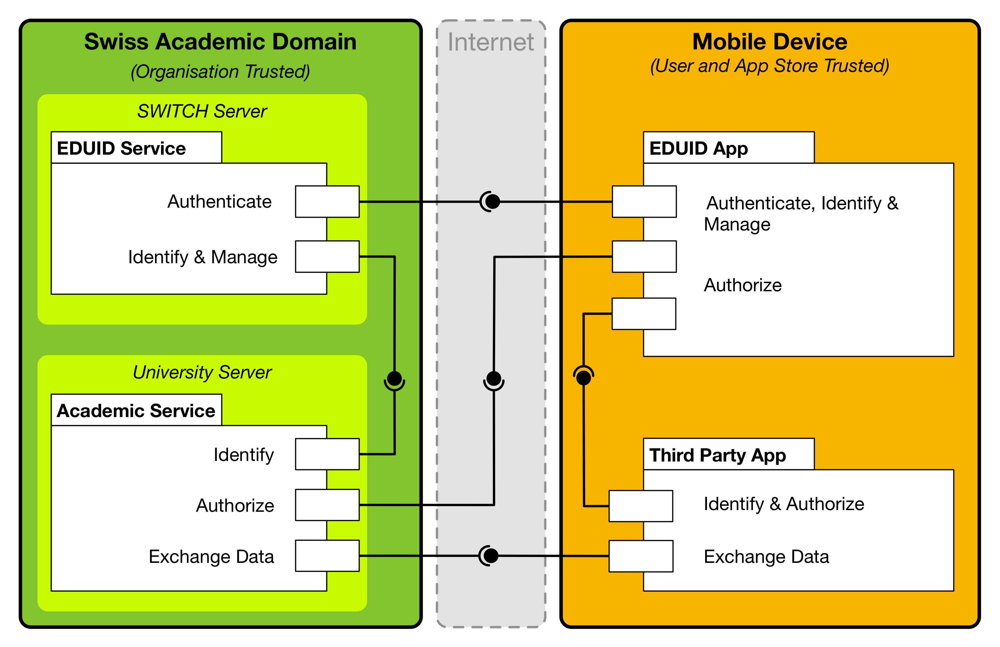
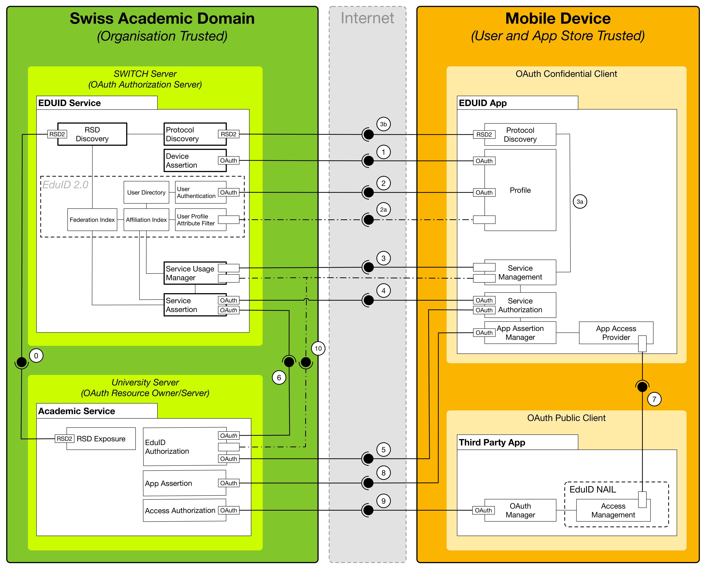

# Service Architecture

The edu-ID Mobile App provides an authorization and authentication interface for securely connecting third party apps with services in the trust domain of Swiss academic services. The edu-ID Mobile App ensures that commercial and non-commercial third party apps can provide added value services based on the existing service infrastructure in Swiss higher education institutions. The edu-ID App's key function is to authorise third party apps on a user's device with academic services within the edu-ID federation. It helps to bridge the user/app store trust domain on the user devices and the trust domain within the Swiss Academic Service Federation.

The edu-ID Mobile App integrates interactions between the edu-ID infrastructure, services in the academic edu-ID federation, and third-party apps installed on the users' devices. It limits service and data exposure to third-parties to authorised sources.

This document describes the overarching system architecture and service interaction protocols.

## Introduction

Authorization is a key element for offering personalised experiences. In higher education, authorization is a key for accreditation processes. With the increase of digital information processes in and around education of universities and universities of applied sciences there is also an increased need to connect mobile application and application-based service into administrative and educational processes.

The eduID Mobile App provides authorization services to third party apps on the mobile devices of federation users.

The edu-ID mobile app is not a stand alone mobile application but mediates processes and data of services within the academic domain and third-party apps. Therefore, the edu-ID Mobile App is part of an IT ecosystem that spawn across two trust domains:

Firstly, the edu-ID links to the Swiss academic trust domain, which is managed via a central edu-ID service as federation manager that connects distributed services at academic institutions participating in the federation. These distributed services include for example data storage, web-conferencing, online collaboration, or learning management systems. In the context of this document this trust domain is called the Academic Trust Domain.

Secondly, it is part of the user-and-app-store trust domain on the users' devices. This trust domain is courated by the end-users by installing apps on their devices and controlled by the app store host. The app store hosts manage access to application developers by setting and enforcing quality and security guidelines. Within the context of this document this trust domain is called User Device.

Within these trust domains there is exaclty one edu-ID service in the Academic Trust Domain and exactly one edu-ID mobile app on the User Device. The edu-ID service and the edu-ID Mobile App are tightly connected. This connection is controlled by the host of the edu-ID service, which creates a separate edu-ID trust domain that bridges the Academic Trust Domain to the User Device.

The Academic Trust Domain connects many distributed "academic services". These services are typically hosted by the institutions that are participating in the federation.

On the User Devices there can be many apps that are related to the users' productivity. These apps are installed and arranged by the owners of the User Devices.

Some of the services in the Academic Trust Doamin services expose service APIs for loosely-coupled machine-to-machine communication. Whereas tightly-coupled machine-to-machine communication requires explicit connections of two services typically initiated system wide by the system administrators, losely-coupled machine-to-machine communication allows unmanaged ad-hoc communications between services, tools and components. Tightly-coupled machine-to-machine communication can only be performed if all commuicators are known at the time of service coupling and controlable. Such connections create a pre-defined trust domain. In highly dynamic environments that spawn trust domains and involve many stakeholders, tight-coupling is resource intensive and does not easily scale. Loosely-coupled machine-to-machine communication overcomes the overhead of tight coupling by distributing coupling responsibility across the different stakeholders in the ecosystem.

Conventional [SAML]() Authentication and Authorization provides reliable identification and single-signon solutions within web-based trust domains. SAML-based approaches have been used to connect native mobile apps and distributed services. These approaches vary on the different platforms and require that native mobile apps are part of the same trust domain as the accessed services. SAML-based approaches are known to be prone to identity theft and viotation of intellectual property rights (IPR) if trust domains are naively assumed for native applications [REFERENCE MISSING](). This limits the applicability of SAML for loosely-coupled machine-to-machine communications, for which ad-hoc trust domains are established.

The edu-ID Mobile App ecosystem primarily focuses on client authorization and does not include an identity layer. Such layer might be provided by dedicated identity services based on LDIF, OpenID or Web-finger. Security aspects related to the identity profile layer are not addressed by the edu-ID Mobile App architecture.

### Relation to Federation Management

The EduID Mobile App is part of the academic trusted federation. The mobile app acts as a frontend for authorizing users on a device.

The mobile app is part of the federation as it is a confidential client to the EduID Service. Under normal circumstances only the EduID Mobile App connects to the authentication endpoints of the EduID service.

Different versions of the app are managed centrally and are separately registered in a way that the EduID Service is capable to identify the different app versions when an instance connects to it. Each EduID Mobile App instance registers to the federation. This allows to keep track of the individual app instances and versions within the federation.

At the federation level it is possible to exclude certain versions of the EduID Mobile App from accessing authorizing users or accessing services.

### Relation to User Management

Registered EduID App instances pass user credentials to the EduID Service for authentcating users. One EduID App instance can authenticate one user. On systems that support multiple user identities, each identity MAY be linked to a separate EduID member.

The EduID is connected to user management for authentication only.

* Users MAY identify EduID App instances that are linked to their accounts.

* Users MAY disconnect EduID App instances from any other EduID client (either an EduID App or via the EduID Web-interface).

* The EduID Service MAY remove EduID App instances for individual users.

* Federation Services MAY exclude access for individual EduID App instances.

* Federation Services MAY allow access for users from selected EduID App instances.

The EduID App has no user management capabilities on its own.

### Relation to User Profiles and Identity Management

After authentication the EduID App is only loosely coupled to user management. For an authorized user the app can access profile information for that user by using the EduID Profile Filter. This information is used for displaying purposes, only.

## Service Interaction Overview

The EduID App depends on the existance of service components. This architecture include primary service components that provide the key functions for authentication and authorization, and secondary service components that for improving the user experience in the diverse and distributed academic federation.

### Federation-level Service Endpoints

The eduID Mobile relies on the OAuth2 protocol endpoint for authenticating users and clients.

* The token endpoint.
* The authorization endpoint.

Both service endpoints are specified in [OAuth2 section 3](https://tools.ietf.org/html/rfc6749#section-3).

### Institution-level Service Endpoints

Federation Services need to provide at least an token service endpoint as a target the eduID Mobile App.

The token endpoint MUST support at least the following grant-types:

* urn:ietf:param:oauth:grant-type:jwt-bearer
* authorization_code

In addition the institution-level service endpoints MAY support scoped request. For services supporting scoped requests the scoping MUST ensure that:

* The EduID Mobile App instances' token MUST be scoped to access the token endpoint.
* Third party app instance tokens MUST get scoped to the authorized protocols.
* Third party app instances MAY have several active authorization tokens for different protocol.

For Federation Services that use token extension MUST scope the third party app for accessing the token endpoint.

## Process Flows

The EduID Mobile App relies on the [Client Crendentials Grant flow](https://tools.ietf.org/html/rfc6749#section-4.4) and the [Authorization Code Grant flow](https://tools.ietf.org/html/rfc6749#section-4.1). The client credentials grant flow is only used for client registration. All flows rely on the [Proof-of-Possession Key Semantics for JSON Web Tokens (JWTs) specification](https://tools.ietf.org/html/rfc7800).

Federation services MAY additionally implement the [Extension Grant flow](https://tools.ietf.org/html/rfc6749#section-4.5). The extension grant flow is only relevant to the [native application integration layer](40-nail-api.md).

### eduID App Authorization

The EduID Mobile App comes in variations for Android and iOS. Each variation has its independent versioning. Each version of the EduID Mobile App requires an unique version key.

Before an EduID Mobile App instance can access the EduID Service endpoints, it MUST register itself using the client credentials Grant flow. Using a [self-assigned client assertion](https://tools.ietf.org/html/rfc7521#section-4.2) as credentials. The client assertion uses the version key for verifying its origin.

A client assertion MUST include the instance's device ID, the device name, device type and OS Version.

The EduID Service MUST provide an unique instance token to the EduID Mobile App instance.

The EduID Service MAY reject individual version keys from authorizing with the service.

The EduID Service MUST allow already confirmed EduID Mobile App instances to upgrade to a higher version if the instance can present the appropriate key.

The EduID Service MUST allow already confirmed EduID Mobile App instances to alter the device information if the correct instance token has been presented.

The EduID Service MAY revoke instance tokens in order to exclude specific clients from accessing the infrastructure. The EduID Service MUST refuse rejected clients from reobtaining a client token.

### User Authentification

### Service Discovery

### Institution-level User Authorization

### Institution-level API Authorization

